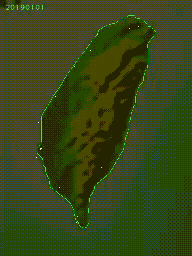
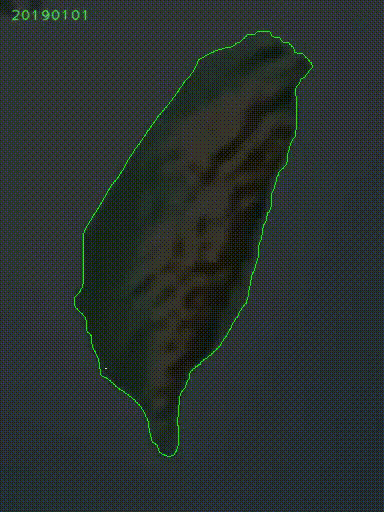
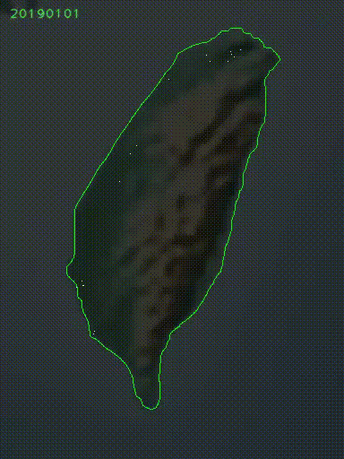
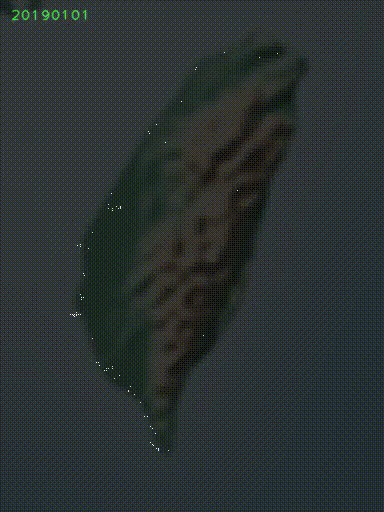
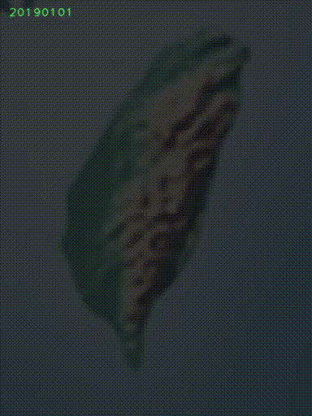

# Dengue Prediction U-Net in Taiwan

This repository contains programs for predicting spatiotemporal distribution of dengue fever outbreak in Chinese Taiwan [1].

## Video Clips

### Visualizatin of Prediction Results with Coastline

    

        

            
            
Video Clip 1A

        

        

            
            
Video Clip 1B

        

        

        
            
Video Clip 1C

        

    

    

        

            
            
Video Clip 1D

        

        

            
            
Video Clip 1E

        

        

        
            
Video Clip 1F

        

    

### Visualizatin of Prediction Results without Coastline

    

        

            
            
Video Clip 1A

        

        

            
            
Video Clip 1B

        

        

        
            
Video Clip 1C

        

    

    

        

            
            
Video Clip 1D

        

        

            
            
Video Clip 1E

        

        

        
            
Video Clip 1F

        

    

## Usage

### 1. Download data and preprocessing

First, we need to download data for dengue prediction from several websites.
The download program are available in `DataProcessing` directory.

You can find the detailed descriptions at README.md in the `DataProcessing` directory.

### 2. Dengue Prediction

In the `DenguePrediction` directory, the following two programs are stored.

1. `unet_segmentation`: you can train and test dengue prediction.

2. `make_video`: you can make a video that shows the prediction results sequentially.

## Reference

[1] S. Anno, T. Hirakawa, S. Sugita, S. Yasumoto, M.-A. Lee, Y. Sasaki, K. Oyoshi,"Challenges and implications of predicting the spatiotemporal distribution of dengue fever outbreak in Chinese Taiwan using remote sensing data and deep learning," Geo-spatial Information Science, DOI: 10.1080/10095020.2022.2144770, 2023.
